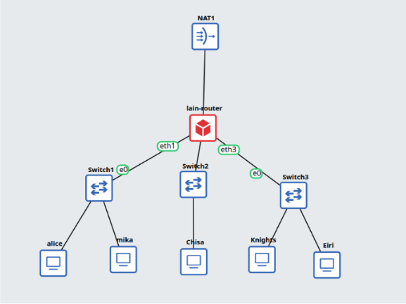
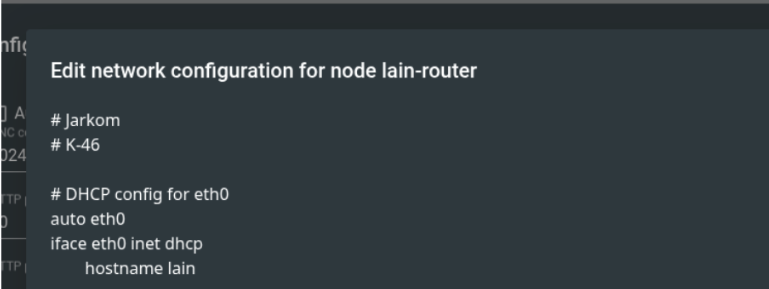
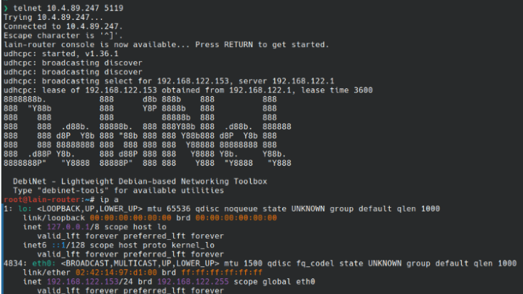
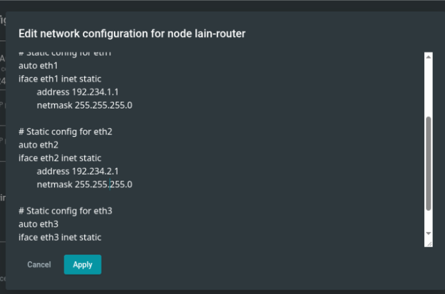
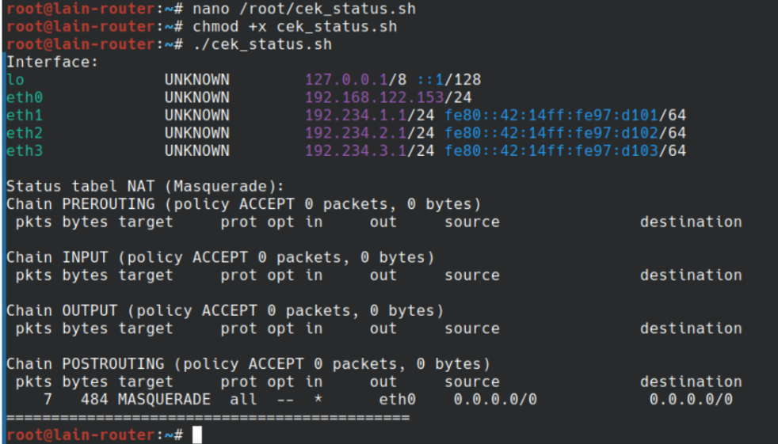

# Jarkom K-46

| Nama              | NRP        |
| ----------------- | ---------- |
| Hendra Manudinata | 5027251051 |
|                   |            |

* Kelompok: K-46

* Prefix IP: 192.234.x.x

---

# Script Tambahan

Untuk memudahkan pengunduhan file soal dari Google Drive langsung ke Node, kami membuat shell script sederhana untuk melakukan *direct download* file dari Drive.

---

# Soal

1. Untuk mempersiapkan pembangunan The Wired, Lain yang berperan sebagai Router membuat tiga Switch/Gateway: Switch 1 menuju dua Entitas yaitu Alice dan Mika, Switch 2 menuju Chisa, sedangkan Switch 3 menuju Knights dan Eiri. Kelima Entitas tersebut dikonfigurasi sebagai Client di GNS3. [GUNAKAN PREFIX IP MASING-MASING KELOMPOK]

Konfigurasi topologi jaringan yang kami buat (sedikit gabung dengan soal 2):



2. Karena menurut Lain pada saat itu The Wired masih terisolasi dari dunia luar, konfigurasikan router Lain agar dapat tersambung langsung ke jaringan internet publik melalui NAT/DHCP pada interface eth0.

Agar router dapat terhubung ke internet, sambung ke NAT pada eth0.

Kemudian, atur agar router mendapatkan IP secara otomatis dari NAT (eth0) melalui DHCP.



Cek melalui console -> ip a



3. Setelah router Lain terhubung ke internet, pastikan seluruh Entitas (Client) di bawah Switch 1, Switch 2, dan Switch 3 dapat saling terhubung dan berkomunikasi satu sama lain melalui konfigurasi routing.

Agar client bisa berkomunikasi satu sama lain, masing-masing dari mereka perlu punya IP. Dan mereka terhubung ke Switch sebagai Gateway, sehingga Switch juga perlu di set IP nya. Setting IP dilakukan secara statis sesuai prefix kelompok.

Set Switch IP pada router:



Kemudian, masing-masing client perlu IP statis juga, dengan catatan:

* Switch 1, gateway: **192.234.1.1**

* Switch 2, gateway: **192.234.2.1**

* Switch 3, gateway: **192.234.3.1**

Setiap client memulai IP dari **.2**.

```
# Static config for eth0
auto eth0
iface eth0 inet static
	address 192.234.1.2
	netmask 255.255.255.0
	gateway 192.234.1.1
```

4. Lain ingin agar setiap Entitas (Client) memiliki kemandirian di The Wired. Konfigurasikan firewall/iptables (NAT Masquerade) dan DNS resolver agar setiap Client dapat terhubung ke internet secara mandiri (dapat melakukan ping ke 8.8.8.8 dan membuka domain web [google.com](http://google.com))

Agar masing-masing client bisa akses internet, router perlu mengaktifkan fitur packet forwarding. Fitur ini ada di kernel Linux. Serta, konfigurasi routing (iptables) perlu ditambah dengan mode NAT Masquerade.

```
# DHCP config for eth0
auto eth0
iface eth0 inet dhcp
	hostname lain
	# IP Forwarding dan NAT agar klien bisa dapat akses internet
	up sysctl -w net.ipv4.ip_forward=1
	up iptables -t nat -A POSTROUTING -o eth0 -j MASQUERADE
```

Kemudian, setiap client perlu mengatur DNS Nameserver agar bisa mengakses domain. Kalau ini ngga ada, client hanya bisa akses IP address (misal 8.8.8.8, bukan google.com).

```
auto eth0
iface eth0 inet static
	...
	up echo "nameserver 8.8.8.8" > /etc/resolv.conf
```

5. Eiri tetap berupaya menanamkan kekacauan ke dalam jaringan. Untuk mengantisipasi restart tiba-tiba, pastikan seluruh konfigurasi jaringan tidak hilang saat semua node di-restart. Buat script verifikasi di /root/cek_status.sh pada router Lain yang menampilkan ringkasan interface (ip -br a) dan status tabel NAT (iptables -t nat -L -v -n) setelah reboot.

```
#!/bin/bash
# /root/cek_status.sh

echo "Interface: "
ip -br a
echo ""

echo "Status tabel NAT (Masquerade): "
iptables -t nat -L -v -n
echo "============================================="

```


