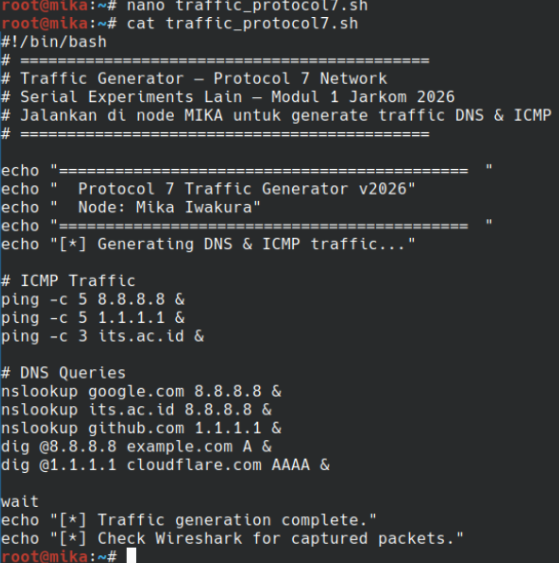
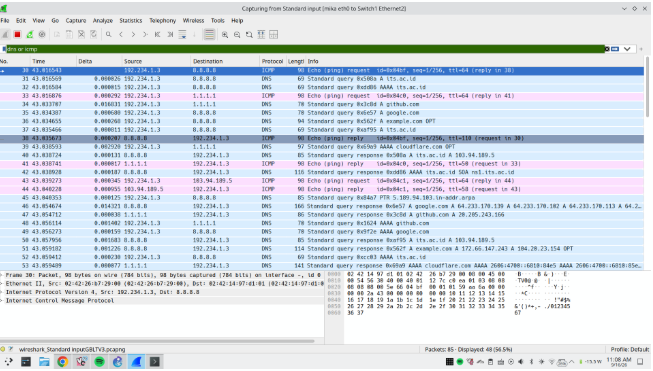
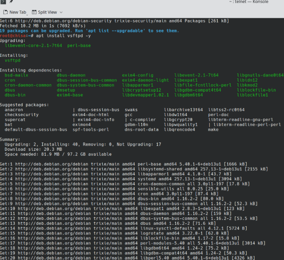
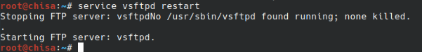
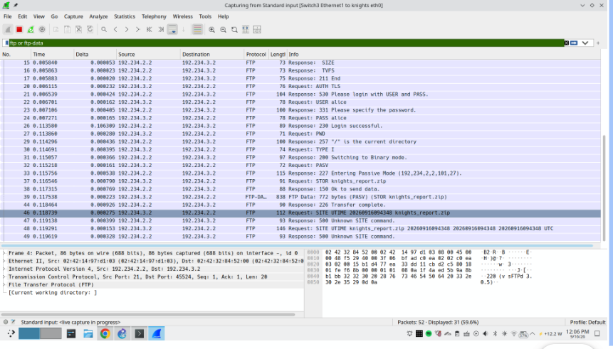
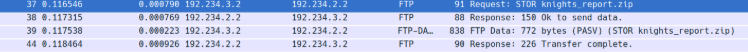
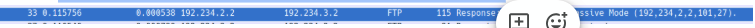
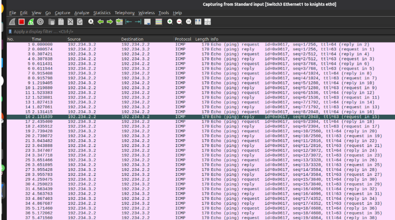
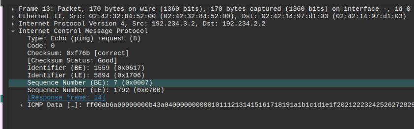
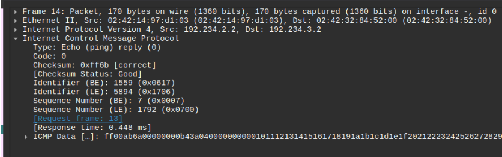

# Jarkom K-46

| Nama              | NRP        |
| ----------------- | ---------- |
| Hendra Manudinata | 5027251051 |
|                   |            |

* Kelompok: K-46

* Prefix IP: 192.234.x.x

---

# Script Tambahan

Untuk memudahkan pengunduhan file soal dari Google Drive langsung ke Node, kami membuat shell script sederhana untuk melakukan *direct download* file dari Drive.

# Soal

1. Untuk mempersiapkan pembangunan The Wired, Lain yang berperan sebagai Router membuat tiga Switch/Gateway: Switch 1 menuju dua Entitas yaitu Alice dan Mika, Switch 2 menuju Chisa, sedangkan Switch 3 menuju Knights dan Eiri. Kelima Entitas tersebut dikonfigurasi sebagai Client di GNS3. [GUNAKAN PREFIX IP MASING-MASING KELOMPOK]

Konfigurasi topologi jaringan yang kami buat (sedikit gabung dengan soal 2):


2. Karena menurut Lain pada saat itu The Wired masih terisolasi dari dunia luar, konfigurasikan router Lain agar dapat tersambung langsung ke jaringan internet publik melalui NAT/DHCP pada interface eth0.

Agar router dapat terhubung ke internet, sambung ke NAT pada eth0.

Kemudian, atur agar router mendapatkan IP secara otomatis dari NAT (eth0) melalui DHCP.


Cek melalui console -> ip a


3. Setelah router Lain terhubung ke internet, pastikan seluruh Entitas (Client) di bawah Switch 1, Switch 2, dan Switch 3 dapat saling terhubung dan berkomunikasi satu sama lain melalui konfigurasi routing.

Agar client bisa berkomunikasi satu sama lain, masing-masing dari mereka perlu punya IP. Dan mereka terhubung ke Switch sebagai Gateway, sehingga Switch juga perlu di set IP nya. Setting IP dilakukan secara statis sesuai prefix kelompok.

Set Switch IP pada router:


Kemudian, masing-masing client perlu IP statis juga, dengan catatan:

* Switch 1, gateway: **192.234.1.1**

* Switch 2, gateway: **192.234.2.1**

* Switch 3, gateway: **192.234.3.1**

Setiap client memulai IP dari **.2**.

```
# Static config for eth0
auto eth0
iface eth0 inet static
	address 192.234.1.2
	netmask 255.255.255.0
	gateway 192.234.1.1
```

4. Lain ingin agar setiap Entitas (Client) memiliki kemandirian di The Wired. Konfigurasikan firewall/iptables (NAT Masquerade) dan DNS resolver agar setiap Client dapat terhubung ke internet secara mandiri (dapat melakukan ping ke 8.8.8.8 dan membuka domain web [google.com](http://google.com))

Agar masing-masing client bisa akses internet, router perlu mengaktifkan fitur packet forwarding. Fitur ini ada di kernel Linux. Serta, konfigurasi routing (iptables) perlu ditambah dengan mode NAT Masquerade.

```
# DHCP config for eth0
auto eth0
iface eth0 inet dhcp
	hostname lain
	# IP Forwarding dan NAT agar klien bisa dapat akses internet
	up sysctl -w net.ipv4.ip_forward=1
	up iptables -t nat -A POSTROUTING -o eth0 -j MASQUERADE
```

Kemudian, setiap client perlu mengatur DNS Nameserver agar bisa mengakses domain. Kalau ini ngga ada, client hanya bisa akses IP address (misal 8.8.8.8, bukan google.com).

```
auto eth0
iface eth0 inet static
	...
	up echo "nameserver 8.8.8.8" > /etc/resolv.conf
```

5. Eiri tetap berupaya menanamkan kekacauan ke dalam jaringan. Untuk mengantisipasi restart tiba-tiba, pastikan seluruh konfigurasi jaringan tidak hilang saat semua node di-restart. Buat script verifikasi di /root/cek_status.sh pada router Lain yang menampilkan ringkasan interface (ip -br a) dan status tabel NAT (iptables -t nat -L -v -n) setelah reboot.

```
#!/bin/bash
# /root/cek_status.sh

echo "Interface: "
ip -br a
echo ""

echo "Status tabel NAT (Masquerade): "
iptables -t nat -L -v -n
echo "============================================="

```


6. Mika mencurigai adanya anomali traffic pada segmen jaringannya. Jalankan generator traffic berikut (link file) pada node Mika, lalu lakukan packet sniffing menggunakan Wireshark pada interface node Mika. Terapkan display filter khusus untuk menyaring paket yang berprotokol DNS atau ICMP. Tunjukkan screenshot hasil filter beserta ringkasan paket yang lolos.

Script dari soal:

```

```



Sebelum menjalankan, klik kana pada kabel antara **Mika** dan **Switch**, kemudian **Start Capture**.

Wireshark akan terbuka dan mulai capture packet yang dikeluarkan/diterima Mika.

Untuk filter packet, gunakan: `dns or icmp`




7. Chisa memutuskan mendirikan FTP Server pada node miliknya dengan shared folder di /var/wired/data. Terapkan kebijakan akses: user alice (hak akses read & write), user mika (dibatasi read-only), dan user eiri (dibatasi tanpa izin akses / blacklist). Buktikan konfigurasi dengan membuat file signal_alice.txt dari user alice, dan buktikan penolakan akses saat user eiri mencoba login.

Karena instalasi server FTP ini cukup panjang dan membutuhkan pengulangan jika container stop (ephemeral), kami membuatnya dalam bentuk script pada Chisa.

```bash
#!/bin/bash
# /root/setup_ftp.sh

set -e

echo "=== Install vsftpd ==="

apt update
apt install -y vsftpd

echo "=== Membuat shared folder ==="

mkdir -p /var/wired/data
chmod 777 /var/wired/data

echo "=== Membuat user FTP ==="

useradd -m alice 2>/dev/null || true
echo "alice:alice" | chpasswd

useradd -m mika 2>/dev/null || true
echo "mika:mika" | chpasswd

useradd -m eiri 2>/dev/null || true
echo "eiri:eiri" | chpasswd

echo "=== Konfigurasi vsftpd ==="

cat > /etc/vsftpd.conf <<'EOF'
listen=YES
listen_ipv6=NO
anonymous_enable=NO
local_enable=YES
write_enable=YES
chroot_local_user=YES
local_root=/var/wired/data
allow_writeable_chroot=YES
userlist_enable=YES
userlist_file=/etc/vsftpd.userlist
userlist_deny=YES
user_config_dir=/etc/vsftpd_user_conf
EOF

echo "=== Membuat userlist ==="

cat > /etc/vsftpd.userlist <<'EOF'
# Blacklist eiri
eiri
EOF

echo "=== Membuat konfigurasi per-user ==="

mkdir -p /etc/vsftpd_user_conf

cat > /etc/vsftpd_user_conf/mika <<'EOF'
write_enable=NO
EOF

cat > /etc/vsftpd_user_conf/alice <<'EOF'
# Alice memiliki akses Read-Write
EOF

echo "=== Restart vsftpd ==="

service vsftpd restart

echo "=== Selesai ==="

```





Pembuktian FTP:

* Alice

```
# Buat tanda
$ echo "Alice masuk woyy." > signal_alice.txt

# Login sebagai Alice
$ lftp -u alice,alice 192.234.2.2
lftp alice@192.234.2.2:~> put signal_alice.txt 
18 bytes transferred         
                       
lftp alice@192.234.2.2:/> ls
-rw-------    1 1000     1000           18 Sep 16 09:10 signal_alice.txt

lftp alice@192.234.2.2:/>
```

* Eiri:

```
$ lftp -u eiri,eiri 192.234.2.2

lftp eiri@192.234.2.2:~> ls
ls: Login failed: 530 Permission denied. 
```

8. Kelompok rahasia Knights perlu mengirimkan dokumen laporan intelijen ke FTP Server Chisa. Lakukan koneksi FTP client dari node Knights ke FTP Server Chisa menggunakan akun alice. Upload file berikut (link file). Analisis sesi Wireshark dan sebutkan: perintah FTP untuk upload (STOR), kode status sukses server (226), dan port data TCP yang dinegosiasikan pada mode PASV.

Di Knights, unduh file dan upload ke FTP:

```
$ ./gdrive_download.sh 1lFepK4wFmx55PnRki3NsHW-ivudSR0vg knights_report.zip
./gdrive_download.sh: line 45: warning: command substitution: ignored null byte in input
  % Total    % Received % Xferd  Average Speed   Time    Time     Time  Current
                                 Dload  Upload   Total   Spent    Left  Speed
100   772  100   772    0     0    549      0  0:00:01  0:00:01 --:--:--   550
Downloaded to knights_report.zip

$ lftp -u alice,alice 192.234.2.2
lftp alice@192.234.2.2:~> put knights_report.zip 
772 bytes transferred

```

Analisa Wireshark dengan membuka koneksi Wireshark dari Knights, dan filter `ftp or ftp-data`



* perintah FTP untuk upload (STOR) & kode status sukses server (226)



* port data TCP yang dinegosiasikan pada mode PASV.



9. Mika mengakses dokumen Protokol Tujuh di (link file) dari FTP Server Chisa. Dari node Mika, unduh file tersebut menggunakan akun mika. Setelah itu, buktikan pembatasan read-only dengan mencoba mengunggah file baru dari akun mika, dan tunjukkan pesan error respon server (error 550 Permission denied) saat mika mencoba melakukan upload.

Chisa:

```
$ cd /var/wired/data/
$ ./gdrive_download.sh 1tKZu0rcti4t-fXX4jtXDSKDBWzsawfoN protocol7_manifesto.zip
./gdrive_download.sh: line 45: warning: command substitution: ignored null byte in input
  % Total    % Received % Xferd  Average Speed   Time    Time     Time  Current
                                 Dload  Upload   Total   Spent    Left  Speed
100  1044  100  1044    0     0    762      0  0:00:01  0:00:01 --:--:--   762
Downloaded to protocol7_manifesto.zip

```

Mika:

```
$ lftp -u mika,mika 192.234.2.2
lftp mika@192.234.2.2:~> ls
-rw-r--r--    1 0        0            1044 Sep 16 19:41 protocol7_manifesto.zip
lftp mika@192.234.2.2:/> get protocol7_manifesto.zip 
1044 bytes transferred
lftp mika@192.234.2.2:/> quit

$ ls
protocol7_manifesto.zip  traffic_protocol7.sh

```

Mika coba upload:

```
$ lftp -u mika,mika 192.234.2.2
lftp mika@192.234.2.2:~> put protocol7_manifesto.zip 
put: Access failed: 550 Permission denied. (protocol7_manifesto.zip)
lftp mika@192.234.2.2:/> 

```

10. Knights melancarkan uji ketahanan koneksi ke server Chisa untuk menguji latensi jaringan The Wired. Kirimkan paket ping dari node Knights ke node Chisa dengan payload khusus 128 bytes dan interval 0.3 detik sebanyak 77 paket (ping -c 77 -s 128 -i 0.3 <IP_Chisa>). Buka Wireshark, catat nilai ICMP Type dan Code untuk Echo Request vs Echo Reply, serta analisis packet loss dan RTT (min/avg/max).



Request:



Reply:




